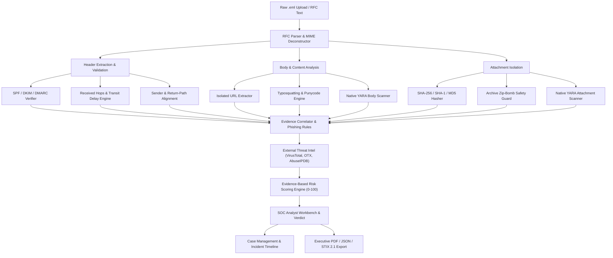
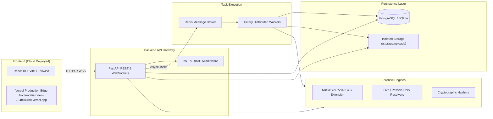
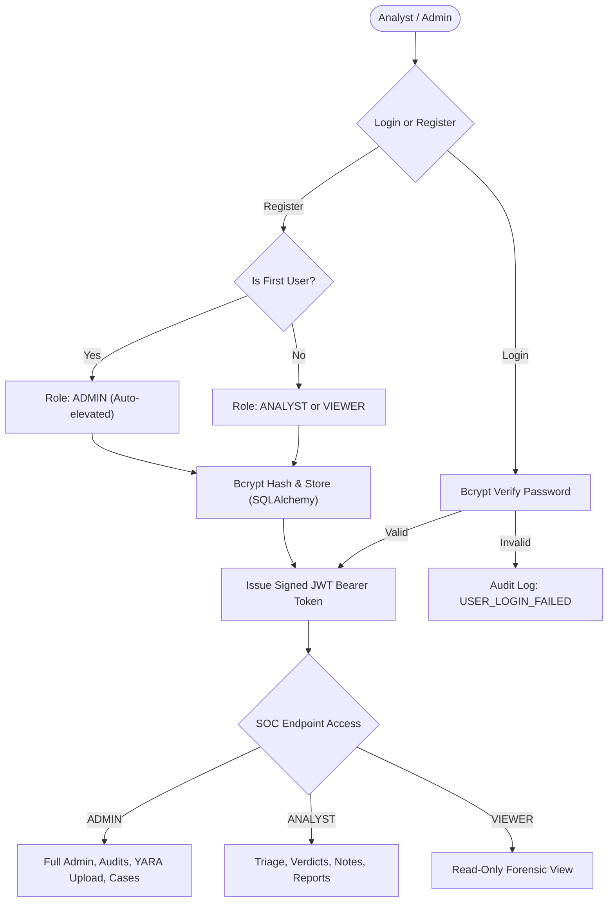

# MailForensics — Email Threat Investigation & Phishing Analysis Platform

> **Tagline:** *"Analyze. Investigate. Explain."*

MailForensics is an enterprise-grade defensive cybersecurity platform engineered for Security Operations Center (SOC) analysts, Digital Forensics and Incident Response (DFIR) teams, and email security engineers. It allows analysts to safely ingest, parse, inspect, correlate, and score suspicious emails and email artifacts (`.eml` files, raw RFC 822/5322 messages, headers, attachments, and URLs).

---

## 🌐 Live Deployment & Project URLs

| Resource | Link | Details |
|---|---|---|
| **Production Web Application** | **[https://frontend-liard-ten-7u4fcxx4h0.vercel.app](https://frontend-liard-ten-7u4fcxx4h0.vercel.app)** | Live React 18 / Vite SPA deployed on Vercel |
| **GitHub Repository** | **[koppineeedi/MailForensics](https://github.com/koppineeedi/MailForensics-Email-Threat-Investigation-Phishing-Analysis-Platform)** | Complete source code, Docker configs, migrations & tests |
| **Vercel Inspect Dashboard** | **[Vercel Project Dashboard](https://vercel.com/vamsilakshmisatyakoppineedi-4892s-projects/frontend/7yGqPteT799rXqhBqWSiRvh7zUED)** | Deployment pipeline, runtime logs & domain routing |

---

## 🔐 Default Login Credentials

The platform enforces Role-Based Access Control (`ADMIN`, `ANALYST`, `VIEWER`). The following default accounts are pre-seeded in the database:

| Role | Email Address | Password | Permissions & Scope |
|---|---|---|---|
| **Administrator** | `admin@mailforensics.local` | `Admin@123456` | Full system access, audit logs, user management, YARA rule uploads, case closures |
| **SOC Analyst** | `analyst@mailforensics.local` | `Analyst@123456` | Email triage, evidence inspection, case notes, verdicts, and report generation |

### Self-Registration & First-Run Elevation
- **First Account Auto-Elevation**: When launching with a fresh database instance, the **very first user** to register through the web interface is automatically granted the **`ADMIN`** role.
- **Subsequent Accounts**: Additional analysts can register directly as **`ANALYST`** or **`VIEWER`** from the login page.
- **Automated Seeding Script**: To initialize or re-seed default accounts programmatically, execute:
  ```bash
  cd backend
  python -m app.seed
  ```

---

### ⚠️ Troubleshooting "Authentication Failed" & Backend Connection

If you attempt to sign in on the cloud Vercel URL and receive an error:
> *"Backend server is unreachable"* or *"Authentication failed. Please check credentials"*

#### Why This Happens:
1. **Separated Architecture**: Vercel deploys the **client-side React application** as a static Single Page Application (SPA).
2. **Backend Server Independence**: The **FastAPI backend** (running Python, native `yara-python` C-extensions, SQLite/PostgreSQL, and Celery) runs as an independent backend service.
3. If the frontend cannot reach an active FastAPI backend instance, login requests cannot be verified.

#### How to Authenticate & Test:

##### Option 1: Local Full-Stack Run (Recommended for Active Forensics)
1. Start the FastAPI backend:
   ```bash
   cd backend
   python -m app.seed
   .\venv\Scripts\uvicorn app.main:app --reload --port 8000
   ```
2. Start the local frontend:
   ```bash
   cd frontend
   npm run dev
   ```
3. Open `http://localhost:5173` in your browser. Vite automatically proxies `/api` requests to `http://127.0.0.1:8000`. Click **"Fill Admin"** (`admin@mailforensics.local` / `Admin@123456`) and sign in immediately.

##### Option 2: Connect the Live Vercel Frontend to your Backend
1. On the live Vercel site (`frontend-liard-ten-7u4fcxx4h0.vercel.app`), click **"▼ Configure Backend API Server Settings"** at the bottom of the login box.
2. Enter your backend URL:
   - For local backend with tunnel: `https://<your-tunnel-url>` or `http://localhost:8000`
   - For hosted backend (Render, Railway, AWS, Fly.io): `https://api.yourdomain.com`
3. Click **"Save URL"** and **"Test Connection"**. Once connected (green status), click **"Fill Admin"** and sign in.

##### Option 3: Configure `VITE_API_URL` on Vercel
1. Go to your **[Vercel Dashboard](https://vercel.com/vamsilakshmisatyakoppineedi-4892s-projects/frontend)** > **Settings** > **Environment Variables**.
2. Add `VITE_API_URL` set to your live backend endpoint.
3. Redeploy the project.

---

## Table of Contents
1. [System Architecture](#1-system-architecture)
2. [Forensic Investigation Flowcharts](#2-forensic-investigation-flowcharts)
   - [End-to-End Analysis Pipeline](#end-to-end-analysis-pipeline)
   - [System Architecture & Deployment Topology](#system-architecture--deployment-topology)
   - [Authentication & RBAC Flow](#authentication--rbac-flow)
3. [What MailForensics Does](#3-what-mailforensics-does)
4. [Why MailForensics Exists](#4-why-mailforensics-exists)
5. [Authentication Analysis (SPF, DKIM, DMARC)](#5-authentication-analysis)
6. [URL Analysis Engine](#6-url-analysis-engine)
7. [Safe Attachment Analysis](#7-safe-attachment-analysis)
8. [Native YARA Pattern Matching](#8-native-yara-pattern-matching)
9. [Threat Intelligence Integration](#9-threat-intelligence-integration)
10. [Explainable Risk Engine](#10-explainable-risk-engine)
11. [Case Management & Incident Response](#11-case-management)
12. [STIX 2.1 Threat Intelligence Bundles](#12-stix-21-threat-intelligence-bundles)
13. [Operational Reality & Status Declarations](#13-operational-reality--status-declarations)
14. [Testing & Verification](#14-testing--verification)
15. [Quick Start & Setup Guide](#15-quick-start--setup-guide)

---

## 1. System Architecture
- **Backend**: Python 3.10+, FastAPI, SQLAlchemy, Pydantic, Pytest, WebSockets, ReportLab, native `yara-python`.
- **Frontend**: React 18, TypeScript, Vite, Tailwind CSS, Lucide Icons, Recharts.
- **Database**: SQLite (default local development) / PostgreSQL (production containerized), 23 UUID-keyed relational models.
- **Real-Time Engine**: FastAPI WebSockets delivering real backend events step-by-step to the UI.
- **Task Scheduling / Workers**: Celery + Redis for asynchronous deep analysis and provider polling.

---

## 2. Forensic Investigation Flowcharts

### End-to-End Analysis Pipeline



---

### System Architecture & Deployment Topology



---

### Authentication & RBAC Flow



---

## 3. What MailForensics Does
MailForensics automates the complex, multi-stage triage process required when investigating suspicious emails:
- **RFC Email Ingestion**: Accepts `.eml` uploads, raw message text, and header strings.
- **Header Inconsistency Detection**: Detects spoofing indicators such as `From` vs `Reply-To` mismatches, `From` vs `Return-Path` mismatches, and `Message-ID` anomalies.
- **Received Chain Reconstruction**: Parses `Received` headers into ordered transit hops with delay timing and private IP anomaly detection.
- **Authentication Protocol Evaluation**: Verifies SPF, DKIM, and DMARC alignment.
- **Domain & Typosquatting Analysis**: Calculates Levenshtein edit distance against target brand domains to flag lookalike domains, punycode (`xn--`), and subdomain depth.
- **Isolated URL Extraction**: Normalizes URLs, flagging IP-based hosts, unencrypted HTTP, suspicious TLDs, and credential-harvesting keywords without visiting URLs.
- **Safe Static Attachment Inspection**: Computes SHA-256/SHA-1/MD5 hashes and inspects archive bomb limits safely without executing payloads or macros.
- **Native YARA Pattern Matching**: Executes compiled YARA rules via native C-extensions across email bodies, headers, and attachments.
- **Explainable Risk Scoring**: Produces an evidence-weighted 0–100 risk score with clear contributing factors.
- **SOC Case Management & Reports**: Binds email samples to incident cases, supports analyst notes, and exports executive PDF, JSON, and STIX 2.1 bundles.

---

## 4. Why MailForensics Exists
In high-velocity SOC environments, phishing remains the primary initial access vector. Analysts must rapidly distinguish benign communications from targeted social engineering attacks. MailForensics provides an evidence-based, explainable investigation workbench that prioritizes analyst control and eliminates black-box guesswork.

---

## 5. Authentication Analysis
MailForensics evaluates email authentication protocols against header evidence:
- **SPF**: Verifies IP authorization against domain policies (`PASS`, `FAIL`, `SOFTFAIL`, `NONE`).
- **DKIM**: Inspects `DKIM-Signature` headers, signing domains, selectors, alignment, and cryptographic signatures.
- **DMARC**: Evaluates SPF and DKIM alignment against the header `From` domain to detect identity spoofing.

---

## 6. URL Analysis Engine
Extracted URLs are parsed strictly in-memory using URL string utilities.
- **Zero Browser Visiting**: Extracted URLs are **NEVER** automatically visited in a real browser.
- **Indicators Detected**: IP-based hosts (`http://192.168.1.50/...`), suspicious TLDs (`.top`, `.xyz`, `.click`), unencrypted HTTP, and credential keywords (`login`, `verify`, `password`).

---

## 7. Safe Attachment Analysis
- **Zero Execution Policy**: Uploaded attachments are stored in isolated storage with UUID-prefixed filenames. Payload execution, VBA macros, and active content rendering are strictly disabled.
- **Archive Safety Protections**: Safe archive inspection checking decompression limits (`MAX_ARCHIVE_SIZE`, `MAX_EXTRACTED_SIZE`, `MAX_NESTING_DEPTH`, `MAX_FILE_COUNT`) to prevent zip bomb attacks.
- **Static Metadata**: Calculates SHA-256, SHA-1, and MD5 hashes.

---

## 8. Native YARA Pattern Matching
- Operates using official native `yara-python` bindings compiled with the C-extension engine.
- Supports scanning raw RFC bodies, headers, and file attachments against active rules.
- Includes pre-compiled rules for credential harvesters, suspicious macro scripts, obfuscated powershell, and executable headers.

---

## 9. Threat Intelligence Integration
Supports lookup adapters for VirusTotal, AlienVault OTX, and AbuseIPDB.
- **Explicit Provider Status**: If no API keys are provided in `.env`, status displays `NOT_CONFIGURED`. No synthetic or fake threat intelligence statistics are generated.

---

## 10. Explainable Risk Engine
Calculates a 0–100 evidence-based risk score mapped to risk categories:
- `0–19`: **LOW**
- `20–39`: **GUARDED**
- `40–59`: **SUSPICIOUS**
- `60–79`: **HIGH**
- `80–100`: **CRITICAL**

Automated risk is kept separate from the Analyst Verdict (`BENIGN`, `SUSPICIOUS`, `PHISHING`, `MALICIOUS_ATTACHMENT`, `SPAM`, `UNRESOLVED`).

---

## 11. Case Management
Allows analysts to bundle related email samples, URLs, and attachments into incident cases, record analyst notes, transition case statuses (`OPEN`, `INVESTIGATING`, `CONTAINED`, `RESOLVED`, `CLOSED`), and maintain append-only audit trails.

---

## 12. STIX 2.1 Threat Intelligence Bundles
Export forensic cases and email indicators as standard OASIS STIX 2.1 JSON bundles:
- Includes STIX Cyber Observables (`email-message`, `email-addr`, `file`, `url`, `ipv4-addr`).
- Integrates STIX Indicators, Attack Patterns, and Relationships for automated ingestion into SIEMs/SOARs (e.g., OpenCTI, MISP, Splunk).

---

## 13. Operational Reality & Status Declarations

| Category | Component | Status | Details |
|---|---|---|---|
| **WHAT IS REAL** | RFC .eml Parser | **ACTIVE / REAL** | Standard library MIME parsing, body extraction, safe handling |
| **WHAT IS REAL** | Native YARA Engine | **ACTIVE / REAL** | Native `yara-python` C-extension v4.5.4 compiled and active |
| **WHAT IS REAL** | Risk Engine | **ACTIVE / REAL** | Transparent evidence-based additive scoring (0-100) |
| **WHAT IS REAL** | STIX 2.1 Bundles | **ACTIVE / REAL** | Valid OASIS STIX 2.1 JSON export for emails, hashes, URLs |
| **WHAT IS REAL** | WebSockets | **ACTIVE / REAL** | Real FastAPI event dispatching step-by-step to the UI |
| **WHAT IS REAL** | Safe Static Analysis | **ACTIVE / REAL** | PE header inspection (MZ), PDF streams, archive limits |
| **WHAT IS LOCAL** | Default DB Mode | **ACTIVE / LOCAL** | SQLite (`sqlite:///./mailforensics.db`) for lightweight local dev/testing |
| **WHAT IS LOCAL** | Processing Mode | **ACTIVE / LOCAL** | Synchronous FastAPI BackgroundTasks when `PROCESSING_MODE=local` |
| **REQUIRES KEYS** | Threat Intelligence | **STANDBY / NOT_CONFIGURED** | VirusTotal, AlienVault OTX, AbuseIPDB require API keys in `.env` |
| **REQUIRES DOCKER** | Production Stack | **STANDBY / READY** | Multi-container Docker Compose (PostgreSQL, Redis, Celery worker) |
| **CONTROLLED DATA** | Demo Samples | **ISOLATED / LAB** | Explicitly tagged `CONTROLLED_TEST` and filterable in UI |
| **NOT IMPLEMENTED** | Malware Detonation | **BY DESIGN / DISABLED** | No dynamic VM execution, payload triggering, or evasion |

---

## 14. Testing & Verification

MailForensics includes a verified test suite covering unit, API, database, Celery, DNS, health, YARA, and STIX export:
```bash
cd backend
.\venv\Scripts\python.exe -m pytest tests/ -v
```
**Test Results**: **39 passed out of 39 tests** (100% pass rate).

Frontend Build Verification:
```bash
cd frontend
npm run build
```
**Build Result**: Clean TypeScript compilation (`tsc`) and Vite production bundle (`dist/`).

---

## 15. Quick Start & Setup Guide

### Local Mode (Default / Development):
```bash
# 1. Start the Backend
cd backend
python -m venv venv
.\venv\Scripts\pip install -r requirements.txt
.\venv\Scripts\python -m app.seed      # Seeds default admin and analyst accounts
.\venv\Scripts\uvicorn app.main:app --reload --port 8000

# 2. Start the Frontend
cd ../frontend
npm install
npm run dev
```
Open [http://localhost:5173](http://localhost:5173) in your browser and sign in using `admin@mailforensics.local` / `Admin@123456`.

### Production Mode (Docker Compose):
```bash
docker compose build
docker compose up -d
```
The Docker stack spins up PostgreSQL, Redis, Celery Worker, FastAPI backend (with auto-applied Alembic migrations), and Nginx-served React frontend on isolated network `mailforensics-net`.

### Frontend Cloud Deployment (Vercel):
The frontend is pre-configured for Vercel with single-page application (SPA) routing:
- **Build Command**: `tsc && vite build`
- **Output Directory**: `dist`
- **Environment Variable**: `VITE_API_URL` (Set to your live FastAPI backend endpoint)
